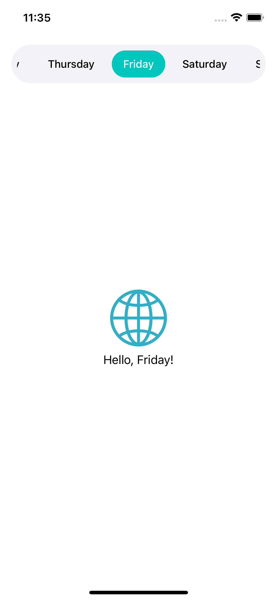

# Scrolling picker

A generic `SwiftUI` scrollable picker which allows you to customize the whole appearence.

```swift
// ...
@State private var selected: Weekday = .monday

var body: some View {
    // ...
    
    ScrollingPicker(weekdays, selected: $selected) { weekday in
        DayPickerItem(name: weekday.name, isSelected: weekday == selected)
    }
    .padding()
    .background(Color(.systemGroupedBackground))
    .clipShape(Capsule())
    
    // ...
}
```



